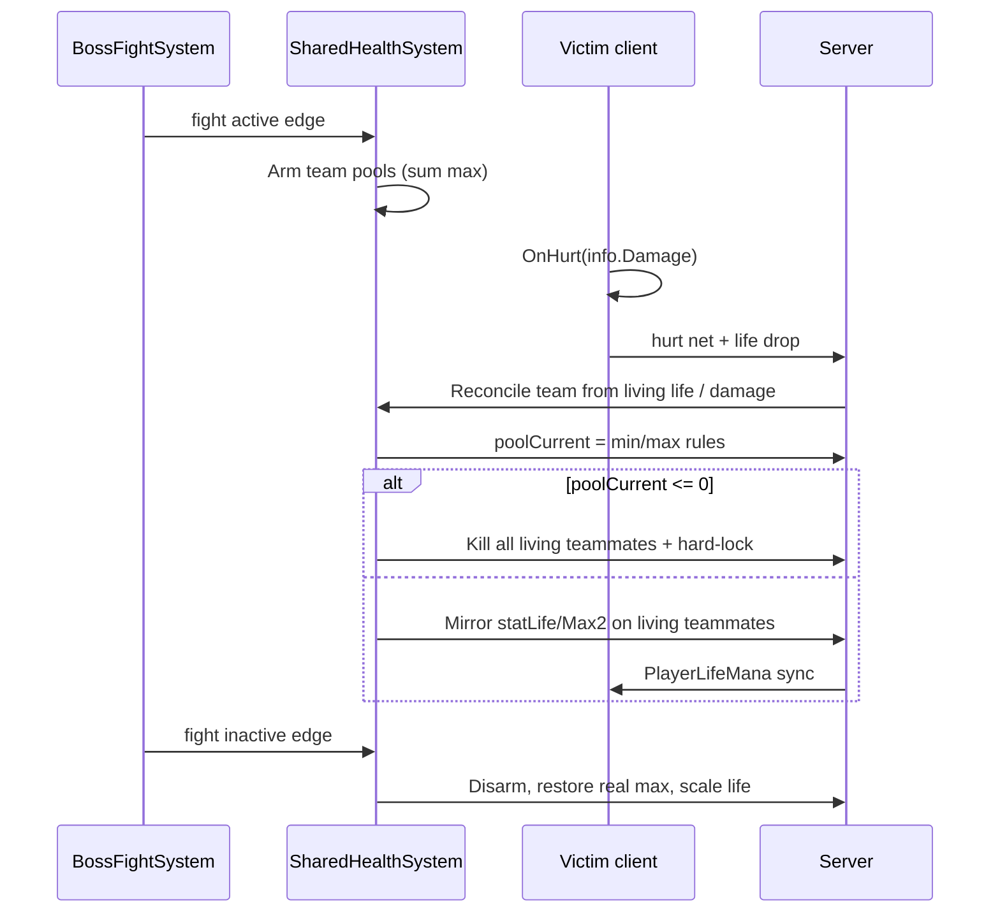

# Shared Boss Health Implementation Plan

> **For agentic workers:** REQUIRED SUB-SKILL: Use superpowers:subagent-driven-development (recommended) or superpowers:executing-plans to implement this plan task-by-task. Steps use checkbox (`- [ ]`) syntax for tracking.

**Goal:** Optional boss-only “one body, many hands” mode: same-team players share one HP pool (sum of max HP), each bar shows the full pool, pool empty = team wipe with no respawn until the boss ends.

**Architecture:** Server-authoritative per-team pool owned by a new `SharedHealthSystem`. While a boss fight is active and config is on, living teammates are mirrored to `poolCurrent` / `poolMax` every tick (vanilla life bar = organism). Damage is applied once to the pool (hurt on the victim + server reconcile); heals raise the pool once. Pool ≤ 0 kills the whole team and hard-locks respawn until `BossFightSystem` fight end (works with existing `InstantRespawnOnBossEnd`).

**Tech Stack:** tModLoader 1.4.4.9 / C# / `ModSystem` + `ModPlayer` hooks / `ServerConfig` / optional `ModPacket` only if life sync needs a push beyond `MessageID.PlayerLifeMana` (16).

## Global Constraints

- Config **off by default** — casual hosts never hit this by accident.
- **Boss fights only** — use existing `BossFightSystem.IsBossFightActive()` (npc.boss + EoW segments).
- **Same team only** — teams 1–5 each get their own pool; `team == 0` players are **not** linked (normal personal HP).
- **No extra HUD** — only inflate/mirror vanilla `statLife` / `statLifeMax2`.
- **Wipe = no respawn until boss ends** — overrides `BossFightLivesMode` budget for linked players during the fight.
- **Any heal tops the pool** — potions, regen, nurse, lifesteal, etc. (detect life increases; don’t double-apply).
- Pool max at fight start = **sum of living teammates’ `statLifeMax2`**; current starts **full** (`= max`).
- Clean-room vs Workshop Shared Health mods — do not copy code.
- Prefer Build+Reload; ModSources → `/Users/adam/dev/DefinitiveMultiplayer`. Packaging may fail with TML003 if tML holds the `.tmod` — DLL compile success is enough; reload in-game.
- No automated test project in-repo — verify with `dotnet build` + in-game smoke checklist per task.
- Do not commit unless the user asks.

## Design lock (from brainstorming)

| Choice | Value |
|---|---|
| Fantasy | One body, many hands (Approach A — mirror pool) |
| When | Boss fights only |
| Pool size | Σ `statLifeMax2` of living same-team players at arm time |
| Who | Same team (1–5) |
| Pool empty | Full team wipe; hard-lock until boss ends |
| Heals | Any heal increases shared current (cap at max) |
| UI | Each player’s bar *is* the pool (looks like more HP) |

## File map

| File | Role |
|---|---|
| `Common/Configs/ServerConfig.cs` | `SharedBossHealth` bool (default `false`) under BossFights |
| `Localization/en-US_Mods.DefinitiveMultiplayer.hjson` | Config label/tooltip; optional death string |
| `Common/Systems/SharedHealthSystem.cs` | **New.** Pool arm/disarm, damage/heal reconcile, mirror, wipe |
| `Common/Players/SharedHealthPlayer.cs` | **New.** Snapshot real max; `OnHurt` notify; help restore |
| `Common/Systems/BossFightSystem.cs` | `MayRespawnThisDeath` / hard-lock honor shared wipe |
| `Common/Systems/DeathScreenSystem.cs` | Optional: reuse/out-of-lives copy for shared wipe |
| `Common/Packets.cs` + `DefinitiveMultiplayer.cs` | Only if a custom pool-sync packet is required after smoke (prefer vanilla life sync first) |
| `wiki/concepts/shared-boss-health.md` | Concept page |
| `wiki/concepts/roadmap.md`, `overview.md`, `multiplayer-config-rules.md`, `boss-fight-lives.md`, `log.md` | Mark planned → done; cross-links |



---

### Task 1: Config + localization

**Files:**
- Modify: `Common/Configs/ServerConfig.cs`
- Modify: `Localization/en-US_Mods.DefinitiveMultiplayer.hjson`

**Interfaces:**
- Produces: `ServerConfig.SharedBossHealth` (`bool`, default `false`)

- [ ] **Step 1: Add server config field**

In `ServerConfig`, under the BossFights group (after `InstantRespawnOnBossEnd`):

```csharp
[DefaultValue(false)]
public bool SharedBossHealth;
```

- [ ] **Step 2: Localize**

In `Configs.ServerConfig` block:

```hjson
SharedBossHealth: {
	Label: Shared Boss Health
	Tooltip: Challenge mode (off by default). During boss fights, each team shares one HP pool equal to the sum of living members' max HP. Everyone's life bar shows the full pool. When the pool hits 0, the whole team dies and cannot respawn until the boss ends. Unteamed players are unchanged. Overrides boss-fight lives for linked teams.
}
```

- [ ] **Step 3: Build**

Run: `/Users/adam/dev/DefinitiveMultiplayer/.dotnet/dotnet build /Users/adam/dev/DefinitiveMultiplayer/DefinitiveMultiplayer.csproj --nologo`

Expected: `DefinitiveMultiplayer.dll` builds. Packaging may hit TML003 if tML is open — acceptable if DLL line succeeded.

- [ ] **Step 4: Commit** (only if user asked to commit)

```bash
git add Common/Configs/ServerConfig.cs Localization/en-US_Mods.DefinitiveMultiplayer.hjson
git commit -m "feat: add SharedBossHealth server config (default off)"
```

---

### Task 2: SharedHealthSystem skeleton — arm / disarm pools

**Files:**
- Create: `Common/Systems/SharedHealthSystem.cs`
- Modify: (none yet beyond create)

**Interfaces:**
- Consumes: `BossFightSystem.IsBossFightActive()`, `ServerConfig.SharedBossHealth`
- Produces:
  - `SharedHealthSystem.IsEnabled()` → config on
  - `SharedHealthSystem.IsLinked(Player)` → enabled + boss active + team 1–5 + pool armed for team
  - `SharedHealthSystem.TryGetPool(int team, out int current, out int max)`
  - Internal arm on fight start, disarm on fight end / `ClearWorld`

- [ ] **Step 1: Create system with fight edge + pool storage**

```csharp
using System.Collections.Generic;
using DefinitiveMultiplayer.Common.Configs;
using Terraria;
using Terraria.ModLoader;

namespace DefinitiveMultiplayer.Common.Systems;

/// <summary>
/// Boss-only shared HP pools per team (1–5). Server/SP authoritative.
/// </summary>
public sealed class SharedHealthSystem : ModSystem
{
	private struct Pool
	{
		public int Current;
		public int Max;
		public bool Wiped; // team already wiped this fight — hard-lock
	}

	private static readonly Dictionary<int, Pool> Pools = new();
	private static bool _armed;
	private static bool _fightWasActive;

	public static bool IsEnabled() =>
		ServerConfig.Instance?.SharedBossHealth == true;

	public static bool IsLinked(Player player) =>
		IsEnabled()
		&& _armed
		&& player.active
		&& !player.dead
		&& player.team is >= 1 and <= 5
		&& Pools.ContainsKey(player.team);

	public static bool IsTeamWiped(int team) =>
		IsEnabled() && _armed && Pools.TryGetValue(team, out Pool p) && p.Wiped;

	public static bool IsPlayerHardLocked(Player player) =>
		player.active
		&& player.dead
		&& player.team is >= 1 and <= 5
		&& IsTeamWiped(player.team);

	public static bool TryGetPool(int team, out int current, out int max)
	{
		if (Pools.TryGetValue(team, out Pool p))
		{
			current = p.Current;
			max = p.Max;
			return true;
		}

		current = 0;
		max = 0;
		return false;
	}

	public override void PostUpdatePlayers()
	{
		if (!IsEnabled())
		{
			if (_armed)
				DisarmAll();
			_fightWasActive = BossFightSystem.IsBossFightActive();
			return;
		}

		bool active = BossFightSystem.IsBossFightActive();
		if (!active)
		{
			if (_armed)
				DisarmAll();
			_fightWasActive = false;
			return;
		}

		if (!_armed)
			ArmAllTeams();
		_fightWasActive = true;

		// Mirror / reconcile added in later tasks
	}

	public override void ClearWorld() => DisarmAll();

	private static void ArmAllTeams()
	{
		Pools.Clear();
		// teams 1–5
		for (int team = 1; team <= 5; team++)
			TryArmTeam(team);
		_armed = true;
	}

	private static void TryArmTeam(int team)
	{
		int max = 0;
		int living = 0;
		for (int i = 0; i < Main.maxPlayers; i++)
		{
			Player p = Main.player[i];
			if (!p.active || p.dead || p.team != team)
				continue;
			living++;
			// Use current equipment max at arm time
			max += p.statLifeMax2;
		}

		if (living == 0 || max <= 0)
			return;

		Pools[team] = new Pool { Current = max, Max = max, Wiped = false };
	}

	private static void DisarmAll()
	{
		// Restore handled in Task 3/7 via SharedHealthPlayer
		Pools.Clear();
		_armed = false;
	}
}
```

Keep `DisarmAll` from restoring life until `SharedHealthPlayer` exists — Task 3 adds restore calls.

- [ ] **Step 2: Build** — same `dotnet build` as Task 1. Expected: success / DLL ok.

- [ ] **Step 3: Commit** (if requested)

```bash
git add Common/Systems/SharedHealthSystem.cs
git commit -m "feat: SharedHealthSystem arm/disarm per-team boss pools"
```

---

### Task 3: Snapshot real max + mirror pool onto bars

**Files:**
- Create: `Common/Players/SharedHealthPlayer.cs`
- Modify: `Common/Systems/SharedHealthSystem.cs`

**Interfaces:**
- Consumes: `SharedHealthSystem.IsLinked`, `TryGetPool`
- Produces: per-player `RealLifeMax` snapshot; `PostUpdateMiscEffects` mirror; restore on disarm

**Why PostUpdateMiscEffects:** equipment/buffs finish adjusting `statLifeMax2` earlier; we override last so the bar shows pool max.

- [ ] **Step 1: Add ModPlayer**

```csharp
using DefinitiveMultiplayer.Common.Systems;
using Terraria;
using Terraria.ModLoader;

namespace DefinitiveMultiplayer.Common.Players;

public sealed class SharedHealthPlayer : ModPlayer
{
	/// <summary>Natural max (post-gear) captured while linked; used to restore after fight.</summary>
	internal int RealLifeMax;
	internal bool HasSnapshot;

	public override void ResetEffects()
	{
		// Do not clear snapshot here — lives across the fight.
	}

	public override void PostUpdateMiscEffects()
	{
		if (!SharedHealthSystem.IsLinked(Player))
			return;

		// Track true personal max under gear before override
		if (!HasSnapshot || Player.statLifeMax2 > 0)
		{
			// Refresh snapshot from pre-override max each tick before we stomp it:
			// First line: capture current gear max, then override.
		}

		int gearMax = Player.statLifeMax2;
		if (!HasSnapshot)
		{
			RealLifeMax = gearMax;
			HasSnapshot = true;
		}
		else
		{
			// Keep RealLifeMax as max of gear readings so mid-fight fruit/planter is remembered for restore
			if (gearMax > 0)
				RealLifeMax = gearMax;
		}

		if (!SharedHealthSystem.TryGetPool(Player.team, out int cur, out int max) || max <= 0)
			return;

		Player.statLifeMax2 = max;
		Player.statLife = Utils.Clamp(cur, 0, max);
	}

	internal void ClearSnapshot()
	{
		HasSnapshot = false;
		RealLifeMax = 0;
	}

	internal void RestoreAfterDisarm()
	{
		if (!HasSnapshot)
			return;

		int restoreMax = RealLifeMax > 0 ? RealLifeMax : Player.statLifeMax;
		Player.statLifeMax2 = restoreMax;
		// Proportional life from last known pool applied in system before clear
		ClearSnapshot();
	}
}
```

**Important implementation note:** Capturing `gearMax` then setting `statLifeMax2 = poolMax` in the same method means the *next* frame’s gear recalculation resets max before this hook — so each frame: vanilla sets gear max → we read it into `RealLifeMax` → we set pool max. That is correct. Do **not** use the stomped value as RealLifeMax after override.

Refine the snapshot block to:

```csharp
// Vanilla/gear already set statLifeMax2 for this tick.
int gearMax = Player.statLifeMax2;
RealLifeMax = gearMax;
HasSnapshot = true;

if (!SharedHealthSystem.TryGetPool(...)) return;
Player.statLifeMax2 = max;
Player.statLife = Utils.Clamp(cur, 0, max);
```

- [ ] **Step 2: On disarm, restore every player**

In `SharedHealthSystem.DisarmAll`, before `Pools.Clear()`:

```csharp
for (int i = 0; i < Main.maxPlayers; i++)
{
	Player p = Main.player[i];
	if (!p.active)
		continue;
	var sp = p.GetModPlayer<SharedHealthPlayer>();
	if (!sp.HasSnapshot)
		continue;

	int restoreMax = sp.RealLifeMax > 0 ? sp.RealLifeMax : p.statLifeMax;
	// If we still have pool info for their team, scale; else keep current clamped
	int life = p.statLife;
	if (p.team is >= 1 and <= 5 && Pools.TryGetValue(p.team, out Pool pool) && pool.Max > 0)
		life = (int)System.Math.Round(restoreMax * (double)pool.Current / pool.Max);
	life = Utils.Clamp(life, 1, restoreMax);
	if (p.dead)
		life = 0;

	p.statLifeMax2 = restoreMax;
	if (!p.dead)
		p.statLife = life;
	sp.ClearSnapshot();

	if (Main.netMode == NetmodeID.Server)
		NetMessage.SendData(MessageID.PlayerLifeMana, -1, -1, null, p.whoAmI);
}
Pools.Clear();
_armed = false;
```

Add usings: `Terraria.ID`, `DefinitiveMultiplayer.Common.Players`.

- [ ] **Step 3: Build + smoke (SP)**

1. Enable Shared Boss Health, start a boss with 1 player — bar should jump to ~same max (sum of one).
2. Disable / kill boss — bar returns to normal max.
3. Two players same team — each bar shows ~sum of both maxes.

- [ ] **Step 4: Commit** (if requested)

---

### Task 4: Damage reconcile (pool decreases once)

**Files:**
- Modify: `Common/Systems/SharedHealthSystem.cs`
- Modify: `Common/Players/SharedHealthPlayer.cs`

**Interfaces:**
- Produces: `SharedHealthSystem.NotifyDamage(int team, int damage, int sourceWhoAmI)`  
- Produces: end-of-tick `ReconcileTeam(team)` that sets pool from mirrored state and re-mirrors

**MP constraint:** `OnHurt` runs on the **local client taking damage**, not necessarily dedicated server. Strategy:

1. **SP / listen-server host:** `OnHurt` → apply damage to pool immediately.
2. **MP clients:** `OnHurt` still applies local life drop; **server** reconciles by reading living teammates’ `statLife` each `PostUpdatePlayers` and taking the **minimum** life among linked living players as `poolCurrent` (all should be equal after mirror; the victim drops first → min wins). Then server re-mirrors everyone up/down to that value and sends `PlayerLifeMana`.

This avoids a custom damage packet for v1 (YAGNI). If smoke shows desync, add `Packets.SharedHealthDamage` in a follow-up step inside this task.

- [ ] **Step 1: OnHurt hook (optional fast path)**

```csharp
// SharedHealthPlayer
public override void OnHurt(Player.HurtInfo info)
{
	if (Main.netMode == NetmodeID.MultiplayerClient)
		return; // server reconciles from life
	if (!SharedHealthSystem.IsLinked(Player))
		return;
	SharedHealthSystem.ApplyDamage(Player.team, info.Damage);
}
```

- [ ] **Step 2: ApplyDamage + Reconcile + Mirror**

```csharp
public static void ApplyDamage(int team, int damage)
{
	if (damage <= 0 || !Pools.TryGetValue(team, out Pool pool) || pool.Wiped)
		return;
	pool.Current = System.Math.Max(0, pool.Current - damage);
	Pools[team] = pool;
	if (pool.Current <= 0)
		WipeTeam(team);
	else
		MirrorTeam(team);
}

private static void ReconcileFromPlayers()
{
	if (Main.netMode == NetmodeID.MultiplayerClient)
		return;

	foreach (int team in new List<int>(Pools.Keys))
	{
		Pool pool = Pools[team];
		if (pool.Wiped)
			continue;

		int minLife = int.MaxValue;
		int living = 0;
		for (int i = 0; i < Main.maxPlayers; i++)
		{
			Player p = Main.player[i];
			if (!p.active || p.dead || p.team != team)
				continue;
			living++;
			if (p.statLife < minLife)
				minLife = p.statLife;
		}

		if (living == 0)
			continue;

		// Heals handled Task 5: also track maxLife among team
		if (minLife < pool.Current)
		{
			pool.Current = System.Math.Max(0, minLife);
			Pools[team] = pool;
			if (pool.Current <= 0)
				WipeTeam(team);
			else
				MirrorTeam(team);
		}
		else
		{
			MirrorTeam(team); // keep everyone equal even if no change
		}
	}
}

private static void MirrorTeam(int team)
{
	if (!Pools.TryGetValue(team, out Pool pool) || pool.Wiped)
		return;

	for (int i = 0; i < Main.maxPlayers; i++)
	{
		Player p = Main.player[i];
		if (!p.active || p.dead || p.team != team)
			continue;

		p.statLifeMax2 = pool.Max;
		p.statLife = Utils.Clamp(pool.Current, 0, pool.Max);
		if (Main.netMode == NetmodeID.Server)
			NetMessage.SendData(MessageID.PlayerLifeMana, -1, -1, null, p.whoAmI);
	}
}
```

Call `ReconcileFromPlayers()` at end of `PostUpdatePlayers` when armed.

**Double-count guard:** If both `OnHurt` ApplyDamage and Reconcile minLife run same frame, damage could apply twice. Pick **one** authority on SP:

- **Preferred v1:** Server/SP **only** `ReconcileFromPlayers` (min life / max life). Remove ApplyDamage from OnHurt **or** make OnHurt only run when `netMode == SinglePlayer` and skip min reconcile that frame.

Simplest rule for implementer:

```text
Authority = ReconcileFromPlayers only (min for damage, max for heals).
OnHurt = no pool math (knockback/iframes stay vanilla on victim only).
```

Document that victim still plays hurt animation; teammates only see life drop via mirror (no fake hurt on them) — correct for “one body.”

- [ ] **Step 3: Smoke**

- 2P same team, boss, hit player A for known damage → both bars drop by ~that amount once.
- Hit A then B same fight → pool keeps dropping, no teleporting back up incorrectly.
- Different teams → independent pools.

- [ ] **Step 4: Commit** (if requested)

---

### Task 5: Heals raise the pool

**Files:**
- Modify: `Common/Systems/SharedHealthSystem.cs` (`ReconcileFromPlayers`)

**Interfaces:**
- Extends reconcile: `pool.Current = Clamp(max(minLife path, maxLife among living), 0, pool.Max)` with correct damage vs heal branching

- [ ] **Step 1: Reconcile both directions**

```csharp
int minLife = int.MaxValue;
int maxLife = 0;
// ... per living teammate:
minLife = Math.Min(minLife, p.statLife);
maxLife = Math.Max(maxLife, p.statLife);

int next = pool.Current;
if (minLife < pool.Current)
	next = minLife; // damage taken somewhere
if (maxLife > pool.Current)
	next = maxLife; // heal somewhere (regen, potion, nurse, lifesteal)

// If both in one frame (rare), prefer min (damage wins) — safer:
if (minLife < pool.Current && maxLife > pool.Current)
	next = minLife;

next = Utils.Clamp(next, 0, pool.Max);
if (next != pool.Current)
{
	pool.Current = next;
	Pools[team] = pool;
	if (next <= 0)
		WipeTeam(team);
	else
		MirrorTeam(team);
}
else
	MirrorTeam(team);
```

Natural regen: each living player regens independently before reconcile → maxLife creeps up → pool rises once → mirror equalizes. Good.

Potions: `GetHealLife` unchanged; life increase flows through reconcile.

- [ ] **Step 2: Smoke**

- Damage down, drink heal potion → both bars rise by heal amount (capped at pool max).
- Campfire regen → slow shared climb.
- Nurse full heal → pool returns to max (or nurse heal amount).

- [ ] **Step 3: Commit** (if requested)

---

### Task 6: Wipe + hard-lock (no respawn until boss ends)

**Files:**
- Modify: `Common/Systems/SharedHealthSystem.cs` — `WipeTeam`
- Modify: `Common/Systems/BossFightSystem.cs` — `MayRespawnThisDeath` / `IsLocalHardLocked`
- Modify: `Localization/en-US_Mods.DefinitiveMultiplayer.hjson` — optional death title
- Modify: `Common/Systems/DeathScreenSystem.cs` — show shared-wipe copy if distinct

**Interfaces:**
- Produces: `WipeTeam(int team)` sets `Wiped`, `Current = 0`, kills all living teammates, marks hard-lock
- `BossFightSystem.MayRespawnThisDeath` returns false when `SharedHealthSystem.IsPlayerHardLocked(player)`

- [ ] **Step 1: WipeTeam**

```csharp
private static void WipeTeam(int team)
{
	if (!Pools.TryGetValue(team, out Pool pool))
		return;
	pool.Current = 0;
	pool.Wiped = true;
	Pools[team] = pool;

	for (int i = 0; i < Main.maxPlayers; i++)
	{
		Player p = Main.player[i];
		if (!p.active || p.team != team)
			continue;

		var bmp = p.GetModPlayer<DefinitiveMultiplayerPlayer>();
		bmp.RespawnAllowedThisDeath = false;

		if (!p.dead)
		{
			p.statLife = 0;
			// Kill with a clear reason — server/SP
			p.KillMe(PlayerDeathReason.ByCustomReason(p.name + " fell with the team..."), 1, 0);
		}
	}
}
```

Only call `WipeTeam` from server/SP (`netMode != MultiplayerClient`). Use localization later if desired:

```hjson
UI.Death.SharedHealthWipe: Your team fell together...
```

For `ByCustomReason`, prefer `NetworkText` / localized string if the codebase already has a pattern; otherwise short English custom reason is fine for v1.

**Anti-recursion:** `KillMe` → death → reconcile sees 0 living → do not re-enter WipeTeam endlessly. Guard: if `pool.Wiped` already, skip. When killing, skip players already dead.

- [ ] **Step 2: Hard-lock integration**

In `BossFightSystem.MayRespawnThisDeath`:

```csharp
internal static bool MayRespawnThisDeath(Player player)
{
	if (SharedHealthSystem.IsPlayerHardLocked(player))
		return false;

	if (!IsBossFightActive() || !IsLivesModeActive())
		return true;

	return player.GetModPlayer<DefinitiveMultiplayerPlayer>().RespawnAllowedThisDeath;
}
```

When shared mode is on, lives budget should not grant respawns after a shared wipe. Before wipe, if someone somehow dies with pool &gt; 0 (edge), `PreKill` safety (optional):

```csharp
// SharedHealthPlayer.PreKill
public override bool PreKill(...)
{
	if (Main.netMode == NetmodeID.MultiplayerClient)
		return true;
	if (!SharedHealthSystem.IsLinked(Player))
		return true;
	if (SharedHealthSystem.TryGetPool(Player.team, out int cur, out _) && cur > 0)
	{
		// Shouldn't die while pool remains — clamp and cancel
		Player.statLife = System.Math.Max(1, cur);
		return false;
	}
	return true;
}
```

- [ ] **Step 3: Death UI**

If `IsLocalHardLocked` already drives “No lives left…”, shared wipe can reuse that string. Optional distinct key:

```hjson
UI.Death.SharedHealthWipe: Your team fell together...
```

In `DeathScreenSystem.DrawDeathUi`, if hard-locked via shared wipe, use the new string; else existing out-of-lives.

- [ ] **Step 4: Smoke**

- Pool to 0 → both die same moment; neither respawns until boss dies/despawns.
- `InstantRespawnOnBossEnd` true → both respawn when boss ends.
- Lives mode PerPlayer with budget left → still cannot respawn after shared wipe.
- Config off → vanilla/lives behavior unchanged.

- [ ] **Step 5: Commit** (if requested)

---

### Task 7: Mid-fight join, team changes, edge cases

**Files:**
- Modify: `Common/Systems/SharedHealthSystem.cs`

**Rules (v1):**

| Edge | Behavior |
|---|---|
| Player joins mid-fight same team | Do **not** top up `pool.Max` (match lives PerTeam). Joiner mirrors existing pool immediately. Snapshot their gear max for restore only. |
| Player changes team mid-fight | Next reconcile: leave old team pool as-is; if new team has pool, mirror them; if new team has no pool and living members exist without pool, do not create mid-fight pool (only arm at fight start). |
| All team dead but boss up | Pool stays `Wiped`; no re-arm until fight ends. |
| Config toggled mid-fight | Host-only config; on enable mid-fight, arm if boss active and not armed; on disable, `DisarmAll` restore. |
| Singleplayer | Full behavior; team still required (TeamToJoin default Red is fine). |

- [ ] **Step 1: EnsureLinkedPlayers mirror even if joined late**

In `PostUpdatePlayers` after arm:

```csharp
// Late joiners: IsLinked requires Pools.ContainsKey — team pool already exists → IsLinked true once living.
ReconcileFromPlayers();
```

No max top-up code.

- [ ] **Step 2: Smoke mid-join** (if feasible): host+client, client connects during boss → client bar matches host pool; killing pool still wipes both.

- [ ] **Step 3: Commit** (if requested)

---

### Task 8: Docs + roadmap

**Files:**
- Create: `wiki/concepts/shared-boss-health.md`
- Modify: `wiki/concepts/roadmap.md` — mark Shared HP done
- Modify: `wiki/overview.md` — planned → implemented
- Modify: `wiki/concepts/multiplayer-config-rules.md` — table row
- Modify: `wiki/concepts/boss-fight-lives.md` — note override when shared on
- Modify: `wiki/log.md` — short entry
- Modify: `wiki/entities/definitive-multiplayer-mod.md` if it lists features

- [ ] **Step 1: Concept page** covering config, pool math, mirror, wipe/hard-lock, interaction with lives + instant respawn, code pointers.

- [ ] **Step 2: Roadmap** — move Shared HP to **done**; priority list strike-through; damage board remains open.

- [ ] **Step 3: Commit** (if requested)

---

### Task 9: Full smoke + polish pass

**Files:** only fixes discovered during smoke.

- [ ] **Step 1: Build+Reload** in tML (disable mod or use reload so TML003 does not block package).

- [ ] **Step 2: Checklist**

| # | Case | Pass? |
|---|---|---|
| 1 | Config off — no pool, normal HP | |
| 2 | Config on, no boss — normal HP | |
| 3 | Boss + 2P same team — both bars ≈ sum max | |
| 4 | Damage once — both drop same amount | |
| 5 | Heal — both rise | |
| 6 | Pool 0 — double kill, hard-lock text, no respawn | |
| 7 | Boss end — instant respawn (if config), normal max restored | |
| 8 | Different teams — independent pools | |
| 9 | Unteamed — unaffected | |
| 10 | Lives budget leftover — still locked after shared wipe | |
| 11 | MP dedicated if available — same as 3–7 | |

- [ ] **Step 3: Fix any failures**; re-run only failed rows.

- [ ] **Step 4: Final commit** (if requested)

```bash
git add -A
git commit -m "feat: shared boss health (team pool, wipe lock)"
```

---

## Self-review

**Spec coverage:**
- One body / Approach A mirror → Tasks 3–4  
- Boss only → Task 2 edges  
- Sum max HP → Task 2 `TryArmTeam`  
- Same team → Task 2  
- Wipe + no respawn until boss end → Task 6  
- Any heal → Task 5  
- Bar is pool, no extra UI → Task 3  
- Off by default → Task 1  
- Lives override → Task 6  
- Instant respawn on boss end compatibility → Task 6/9  

**Placeholders:** none intentional; packet fallback only if smoke proves need.

**Type consistency:** `SharedBossHealth`, `IsLinked`, `IsPlayerHardLocked`, `TryGetPool`, `WipeTeam`, `RealLifeMax` / `HasSnapshot` used consistently across tasks.

## Out of scope (v1)

- Buff/debuff sharing  
- Damage split / average pool modes  
- Extra pool HUD  
- DeathLink outside shared pool (pool empty is the only wipe trigger, plus PreKill safety)  
- Mid-fight pool max top-up on join  
- Damage board (separate roadmap item)
