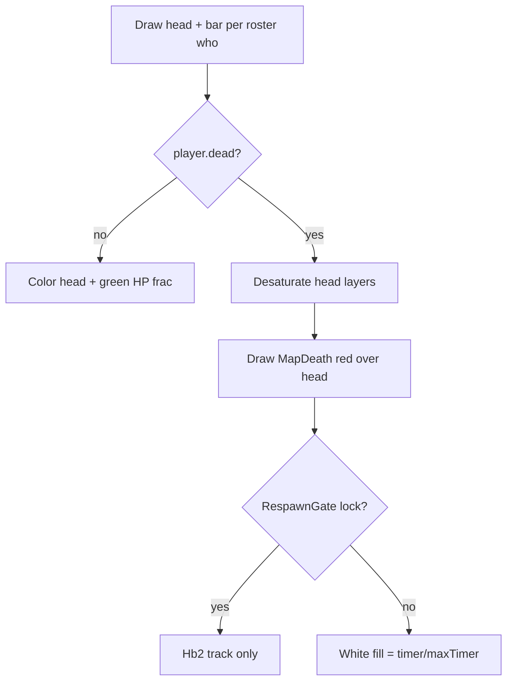

# Dead Feed Cell (Grayscale + MapDeath X + Respawn Bar) Implementation Plan

> **For agentic workers:** REQUIRED SUB-SKILL: Use superpowers:subagent-driven-development (recommended) or superpowers:executing-plans to implement this plan task-by-task. Steps use checkbox (`- [ ]`) syntax for tracking.

**Goal:** In the boss-fight party feed, dead teammates show a true-grayscale head, a red vanilla MapDeath X over the icon, and an under-head white respawn cooldown bar (full → empty); hard-locked dead show empty track only.

**Architecture:** Draw-only changes in `FightStatsFeedState` (Approach A). Snapshot each roster player's peak `respawnTimer` on the dead rising edge for fill fraction. Use existing `RespawnGate.GetLockReason` for hard-lock (empty bar). No new packets — vanilla `KillMe` sets `respawnTimer` via `GetRespawnTime` on all clients; `UpdateDead` decrements it everywhere.

**Tech Stack:** tModLoader 1.4.4.9 / C# / `UIState` SpriteBatch draw / `TextureAssets.MapDeath` / `TextureAssets.Hb1`+`Hb2` / `RespawnGate`

## Global Constraints

- Scope = **boss-fight party feed only** (`FightStatsFeedState`). Do not change spectate grid unless asked later.
- Hard-locked (`RespawnGate.GetLockReason != None`) → **empty bar** (Hb2 track only, no white fill). Still grayscale + red X.
- Countdown bar: **white** fill, same rect as HP bar, full at death → empty when about to respawn.
- Head: **true grayscale** (luma desaturate per layer), not only `Color.Gray` multiply.
- X: vanilla `TextureAssets.MapDeath`, **red tint**, centered over the 32×32 head slot, drawn after the portrait.
- Prefer Build+Reload; ModSources → `/Users/adam/dev/BestMultiplayer`. Packaging may fail with TML003 if tML holds the `.tmod` — DLL compile success is enough; reload in-game.
- No automated test project in-repo — verify with `dotnet build` + in-game smoke checklist.
- Do not commit unless the user asks.
- No new comments unless needed for non-obvious vanilla constants already in file style.

## Design lock (from brainstorming)

| Choice | Value |
|---|---|
| Scope | Fight stats feed only |
| Alive | Unchanged (color head, green HP) |
| Dead + can respawn | Grayscale head + red MapDeath X + white depleting bar |
| Dead + hard-locked | Grayscale + X + **empty** track |
| Timer source | `player.respawnTimer` + per-who peak snapshot on death edge |
| Net | No custom sync |

## File map

| File | Role |
|---|---|
| `Common/UI/FightStatsFeedState.cs` | **Only file.** Snapshot max timers; grayscale head; MapDeath overlay; dead/locked bar branch; hover text |
| `Common/Systems/RespawnGate.cs` | **Read only** — `GetLockReason` / lock enum (already exists) |
| `Common/UI/PlayerHeadRenderer.cs` | **Unchanged** — keep tint API; desaturate colors *before* calling Draw |



---

### Task 1: Respawn max snapshot + white cooldown bar

**Files:**
- Modify: `Common/UI/FightStatsFeedState.cs`

**Interfaces:**
- Consumes: `Player.dead`, `Player.respawnTimer`, `RespawnGate.GetLockReason(Player)`
- Produces: private `int[] _respawnMax` (or `Dictionary`) keyed by `whoAmI`; `DrawHpBar` dead/locked branches

- [ ] **Step 1: Add peak-timer bookkeeping on the feed state**

Add a field (fixed array is fine — `Main.maxPlayers`):

```csharp
// Peak respawnTimer captured on dead rising edge (for white bar frac).
private readonly int[] _respawnMax = new int[Main.maxPlayers];
private readonly bool[] _wasDead = new bool[Main.maxPlayers];
```

In `Update`, after `BuildRoster()`, sync snapshots for roster members (and clear when not dead):

```csharp
private void TrackRespawnSnapshots()
{
	for (int i = 0; i < Main.maxPlayers; i++)
	{
		Player p = Main.player[i];
		bool dead = p.active && p.dead;
		if (dead && !_wasDead[i])
			_respawnMax[i] = Math.Max(1, p.respawnTimer);
		if (!dead)
			_respawnMax[i] = 0;
		_wasDead[i] = dead;
	}
}
```

Call from `Update` after `BuildRoster()`.

- [ ] **Step 2: Branch `DrawHpBar` for dead / locked / alive**

Replace the body of `DrawHpBar` so:

```csharp
private static void DrawHpBar(SpriteBatch sb, int whoAmI, Rectangle rect, float alpha, int respawnMax)
{
	Player player = Main.player[whoAmI];
	Texture2D track = TextureAssets.Hb2.Value;
	Texture2D fill = TextureAssets.Hb1.Value;
	sb.Draw(track, rect, Color.White * alpha);

	float frac = 0f;
	Color fillColor = new Color(60, 200, 70) * alpha;

	if (player.dead)
	{
		if (RespawnGate.GetLockReason(player) == RespawnGate.LockReason.None
		    && respawnMax > 0 && player.respawnTimer > 0)
		{
			frac = MathHelper.Clamp(player.respawnTimer / (float)respawnMax, 0f, 1f);
			fillColor = Color.White * alpha;
		}
		// hard-locked or no timer → empty track only
	}
	else if (player.statLifeMax2 > 0)
	{
		frac = MathHelper.Clamp(player.statLife / (float)player.statLifeMax2, 0f, 1f);
	}

	if (frac > 0f)
	{
		int srcW = Math.Max(1, (int)(fill.Width * frac));
		int fillW = Math.Max(1, (int)(rect.Width * frac));
		sb.Draw(fill, new Rectangle(rect.X, rect.Y, fillW, rect.Height),
			new Rectangle(0, 0, srcW, fill.Height), fillColor);
	}

	if (rect.Contains(Main.MouseScreen.ToPoint()))
		SetHover(whoAmI, player);
}
```

Update the call site in `DrawChildren`:

```csharp
DrawHpBar(spriteBatch, who, barRect, alpha, _respawnMax[who]);
```

Note: `DrawHpBar` was `static` and used only feed state — either keep static and pass `respawnMax`, or make instance method. Prefer pass-through as above.

- [ ] **Step 3: Hover text for dead countdown / locked**

Update `SetHover`:

```csharp
private static void SetHover(int whoAmI, Player player)
{
	Main.LocalPlayer.mouseInterface = true;
	string label = whoAmI == Main.myPlayer
		? $"{player.name} ({Language.GetTextValue("Mods.BestMultiplayer.UI.Spectate.You")})"
		: player.name;

	if (player.dead)
	{
		if (RespawnGate.GetLockReason(player) != RespawnGate.LockReason.None)
			label += " (locked)";
		else if (player.respawnTimer > 0)
		{
			int seconds = (player.respawnTimer + 59) / 60;
			label += $" ({seconds}s)";
		}
		else
			label += " (dead)";
	}
	else if (player.statLifeMax2 > 0)
	{
		label += $" ({player.statLife}/{player.statLifeMax2})";
	}

	Main.hoverItemName = label;
}
```

- [ ] **Step 4: Build**

Run from repo root:

```bash
dotnet build
```

Expected: `Build succeeded` (warnings OK).

- [ ] **Step 5: In-game smoke (bar only is fine if head still Gray)**

1. Host multiplayer, start a boss fight so the feed appears.
2. Die (with lives remaining): under-head bar should be **white full**, then shrink toward empty as respawn approaches.
3. Hard-lock (0 lives or shared wipe): under-head bar should be **empty track** only.
4. Alive teammates still green HP.

---

### Task 2: True grayscale head + red MapDeath X

**Files:**
- Modify: `Common/UI/FightStatsFeedState.cs` (`DrawHead` only)

**Interfaces:**
- Consumes: `PlayerHeadRenderer.Draw(sb, player, pos, tint, scale)`, `TextureAssets.MapDeath`
- Produces: dead head look locked in design table

- [ ] **Step 1: Add grayscale helper**

```csharp
private static Color ToGray(Color c)
{
	// Rec. 601 luma
	int g = (c.R * 30 + c.G * 59 + c.B * 11) / 100;
	return new Color(g, g, g, c.A);
}
```

- [ ] **Step 2: Rewrite `DrawHead` dead path**

`PlayerHeadRenderer` multiplies each layer by player colors × tint. For dead players, pass a grayscale tint built from white, **and** desaturate by drawing through a gray multiplier on the player colors — simplest approach that works with the existing renderer without editing it:

Option used (no PlayerHeadRenderer change): pass `tint = Color.White * opacity` always for structure, but for dead we need layer colors gray. That requires either:

1. Extending `PlayerHeadRenderer` with a `grayscale` bool, or  
2. Duplicating the 4-layer draw in `DrawHead` for the dead path.

**Prefer (1) — one bool on the shared renderer** so spectate can reuse later without scope creep now:

Modify `Common/UI/PlayerHeadRenderer.cs`:

```csharp
internal static void Draw(SpriteBatch sb, Player player, Vector2 pos, Color tint, float scale = 1f, bool grayscale = false)
{
	Color skin = player.skinColor.MultiplyRGBA(tint);
	Color eyes = player.eyeColor.MultiplyRGBA(tint);
	Color body = Color.White.MultiplyRGBA(tint);
	Color hair = player.hairColor.MultiplyRGBA(tint);
	if (grayscale)
	{
		skin = ToGray(skin);
		eyes = ToGray(eyes);
		body = ToGray(body);
		hair = ToGray(hair);
	}
	DrawLayer(sb, TextureAssets.Players[0, 0], pos, skin, scale);
	DrawLayer(sb, TextureAssets.Players[0, 2], pos, eyes, scale);
	DrawLayer(sb, TextureAssets.Players[0, 1], pos, body, scale);
	DrawLayer(sb, TextureAssets.PlayerHair[player.hair], pos, hair, scale);
}

private static Color ToGray(Color c)
{
	int g = (c.R * 30 + c.G * 59 + c.B * 11) / 100;
	return new Color(g, g, g, c.A);
}
```

If `ToGray` lives only on the renderer, **do not duplicate** it on the feed state.

Then `DrawHead` in feed:

```csharp
private static void DrawHead(SpriteBatch sb, int whoAmI, Rectangle rect, float opacity, bool selected)
{
	Player player = Main.player[whoAmI];
	Utils.DrawInvBG(sb, rect, selected
		? new Color(80, 160, 80, 180)
		: new Color(40, 50, 80, 160));

	if (selected)
		SpectateHeadButton.DrawSelectionBorder(sb, rect, Color.LightGreen);

	Color mul = Color.White * opacity;
	float scale = Head / 40f;
	var pos = new Vector2(
		rect.X + (rect.Width - 40 * scale) / 2f,
		rect.Y + (rect.Height - 28 * scale) / 2f);
	PlayerHeadRenderer.Draw(sb, player, pos, mul, scale, grayscale: player.dead);

	if (player.dead)
		DrawDeathMark(sb, rect, opacity);

	if (rect.Contains(Main.MouseScreen.ToPoint()))
		SetHover(whoAmI, player);
}
```

- [ ] **Step 3: Draw red MapDeath centered on head rect**

```csharp
private static void DrawDeathMark(SpriteBatch sb, Rectangle headRect, float opacity)
{
	Texture2D tex = TextureAssets.MapDeath.Value;
	// Fit inside head with a little inset so X reads as overlay, not cropped.
	float fit = Math.Min(headRect.Width, headRect.Height) * 0.85f;
	float scale = fit / Math.Max(tex.Width, tex.Height);
	var origin = new Vector2(tex.Width * 0.5f, tex.Height * 0.5f);
	var center = new Vector2(headRect.X + headRect.Width * 0.5f, headRect.Y + headRect.Height * 0.5f);
	sb.Draw(tex, center, null, Color.Red * opacity, 0f, origin, scale, SpriteEffects.None, 0f);
}
```

Vanilla map uses `Color.White`; design lock is **red**.

- [ ] **Step 4: Build**

```bash
dotnet build
```

Expected: `Build succeeded`.

- [ ] **Step 5: In-game smoke (full dead cell)**

1. Boss fight feed visible.
2. Kill a teammate (or self) with lives left:
   - Head is grayscale (no skin/hair hue).
   - Red X covers the head icon.
   - White bar starts full and depletes.
3. Exhaust lives / shared wipe:
   - Still grayscale + red X.
   - Bar empty (track only).
4. On respawn: color head + green HP restored; X gone.
5. Selected green plate/border still works on dead cells.
6. Feed blink freeze still multiplies alpha on dead cells.

---

### Task 3: Wiki note (optional, only if touching roadmap this session)

**Files:**
- Modify: `wiki/concepts/boss-fight-stats.md` (one bullet under UI)
- Modify: `wiki/log.md` (one line)

Only if the implementer is already updating docs; otherwise skip — feature is pure UI.

- [ ] **Step 1: Log entry**

```markdown
## [2026-07-31] ux | Dead cells on fight feed
- Grayscale head + red MapDeath X; white respawn bar (empty when hard-locked)
```

- [ ] **Step 2: Build not required**

---

## Self-review

| Spec item | Task |
|---|---|
| Grayscale head | Task 2 |
| Red MapDeath X over icon | Task 2 |
| White cooldown bar full→empty | Task 1 |
| In-place under head (same rect) | Task 1 |
| Hard-locked → empty bar | Task 1 |
| Feed only | File map |
| No custom net | Architecture |

No placeholders. Types: `RespawnGate.LockReason`, `Player.respawnTimer` (`int` ticks), `TextureAssets.MapDeath`.

## Manual test matrix (final)

| # | Setup | Expect |
|---|---|---|
| 1 | Classic/Expert boss, die with lives | Gray head, red X, white bar drains |
| 2 | Die at 0 lives (PerPlayer) | Gray + X, empty bar, hover `(locked)` |
| 3 | Shared HP wipe | Same as 2 |
| 4 | Respawn / boss end instant | Normal color + green HP |
| 5 | 2+ clients | Remote dead teammate bar tracks (same GetRespawnTime) |
| 6 | UI scale 100% and 200% | X still centered on head; bar width = head width |
