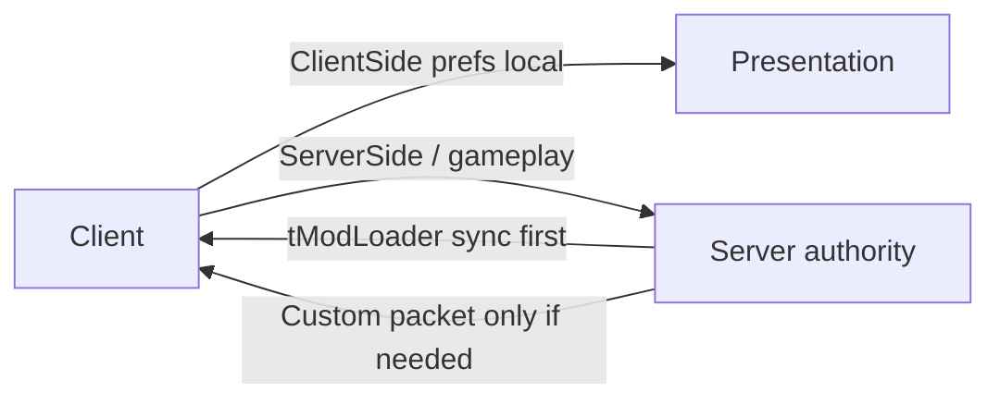

Implemented as two `ModConfig` classes.[^1]

| Concern | Rule | Type |
|---|---|---|
| Client presentation prefs | `ConfigScope.ClientSide` | `ClientConfig` |
| Shared gameplay / server policy | `ConfigScope.ServerSide` | `ServerConfig` |
| Who may edit server config in MP | Host only (`AcceptClientChanges`) | `ServerConfig` |
| Custom network packets | Only for runtime state tModLoader does not already sync | — |
| Load side | `side = Both` in `build.txt`[^2] | — |

## ServerConfig fields

| Field | Default | Status | Intent |
|---|---|---|---|
| `TeamToJoin` | `Red` | **Done** (join-once) | Assign team on world enter; `None` disables; no soft-lock — see [TeamToJoin](team-to-join.md) |
| `NoBossFightRespawn` | `true` | Config only | Block respawn while boss/EoW active |
| `WitchDoctorWormhole` | `true` | Config only | Witch Doctor sells Wormhole Potion |

## ClientConfig fields (scaffold)

| Field | Default | Intent |
|---|---|---|
| `SpectateOnDeath` | `true` | Follow teammate when dead |
| `StopSpectateOnRespawn` | `true` | Clear spectate on respawn |

## Related

- [TeamToJoin](team-to-join.md)
- [Mod anatomy](mod-anatomy.md)
- [Scaffold conventions](scaffold-conventions.md)
- [Better Multiplayer baseline](../entities/better-multiplayer-baseline.md)

[^1]: Common/Configs/ServerConfig.cs, Common/Configs/ClientConfig.cs, Common/Players/BestMultiplayerPlayer.cs
[^2]: build.txt
