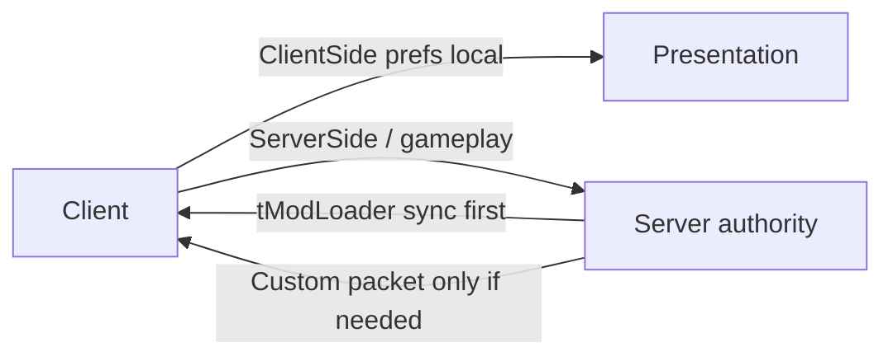

Implemented as two `ModConfig` classes.[^1]

| Concern | Rule | Type |
|---|---|---|
| Client presentation prefs | `ConfigScope.ClientSide` | `ClientConfig` |
| Shared gameplay / server policy | `ConfigScope.ServerSide` | `ServerConfig` |
| Who may edit server config in MP | Any client (`AcceptClientChanges` → true; cloud/dedicated friendly) | `ServerConfig` |
| Custom network packets | Only for runtime state tModLoader does not already sync | — |
| Load side | `side = Both` in `build.txt`[^2] | — |

## ServerConfig fields

| Field | Default | Status | Intent |
|---|---|---|---|
| `TeamToJoin` | `Red` | **Done** (join-once) | Assign team on world enter; `None` disables; no soft-lock — see [TeamToJoin](team-to-join.md) |
| `BossFightLivesMode` | `PerPlayer` | **Done** | `Off` / `PerPlayer` / `PerTeam` — see [Boss fight lives](boss-fight-lives.md) |
| `BossFightRespawns` | `1` | **Done** | PerPlayer budget; `0` = BM first-death lock; ignored in PerTeam (pool = team size) |
| `RespawnAtTeammateDuringBoss` | `true` | **Done** | Boss-death respawn beside **spectate target** only; else vanilla spawn |
| `BossFightStatsEnabled` | `true` | **Done** | Live boss-fight stats feed — see [boss fight stats](boss-fight-stats.md) |
| `BossFightDefenseMultiplier` | `1.0` | **Done** | Fraction of player defense during boss fights (0.1–1.0) — see [boss fight defense](boss-fight-defense.md) |
| *(always on)* Instant respawn on boss end | — | **Done** | Not configurable; dead players always get `respawnTimer = 0` when the fight ends |
| `SharedHealthEnabled` | `false` | **Done** | Shared team HP — see [shared team health](shared-boss-health.md) |
| `SharedHealthBossesOnly` | `false` | **Done** | Limit shared HP to boss fights |
| `SharedHealthMultiplier` | `1.5` | **Done** | Team HP multiplier — pool max × Σ living max HP (1–3); UI-gated on master |
| `UnlimitedTeamTeleport` | `true` | **Done** | Virtual wormhole for map team-TP — see [Unlimited team teleport](unlimited-team-teleport.md) |
| `BlockUnlimitedTeleportDuringBoss` | `false` | **Done** | When true, unlimited rule off during boss/EoW |

## ClientConfig fields

| Field | Default | Intent |
|---|---|---|
| `SpectateOnDeath` | `true` | Auto-follow teammate after death intro |
| `ShowBossFightStats` | `true` | Show boss-fight stats feed locally |

## Config UI

Calamity-style theming via stock tML attributes (purple instead of red).

| Piece | Value |
|---|---|
| Panel | `BackgroundColor(42, 28, 58, 216)` on each `ModConfig` |
| Rows | `BackgroundColor(110, 62, 168, 192)` on every option |
| Slider | `SliderColor(224, 165, 56, 128)` on `SharedHealthMultiplier`, `BossFightDefenseMultiplier` |
| Icons | Vanilla `[i:Item]` chat tags in Labels |
| Display names | `Server Config` / `Client Config` |

### Collapsing dependents

| Child | Visible when |
|---|---|
| `BossFightRespawns` | Lives mode is `PerPlayer` or `PerTeam` |
| `SharedHealthBossesOnly` | `SharedHealthEnabled` |
| `SharedHealthMultiplier` | `SharedHealthEnabled` |
| `BlockUnlimitedTeleportDuringBoss` | `UnlimitedTeamTeleport` |

Implemented with `ConfigGateAttribute` + `GatedBooleanElement` / `GatedFloatElement` (and existing `BossFightRespawnsElement`). Constants live in `ConfigUiStyle`.

## Related

- [TeamToJoin](team-to-join.md)
- [Boss fight lives](boss-fight-lives.md)
- [Boss fight defense](boss-fight-defense.md)
- [Unlimited team teleport](unlimited-team-teleport.md)
- [Mod anatomy](mod-anatomy.md)
- [Scaffold conventions](scaffold-conventions.md)
- [Better Multiplayer baseline](../entities/better-multiplayer-baseline.md)

[^1]: Common/Configs/ServerConfig.cs, Common/Configs/ClientConfig.cs, Common/Configs/ConfigUiStyle.cs, Common/Configs/ConfigGateAttribute.cs, Common/Configs/GatedBooleanElement.cs, Common/Configs/GatedFloatElement.cs, Common/Players/DefinitiveMultiplayerPlayer.cs
[^2]: build.txt
