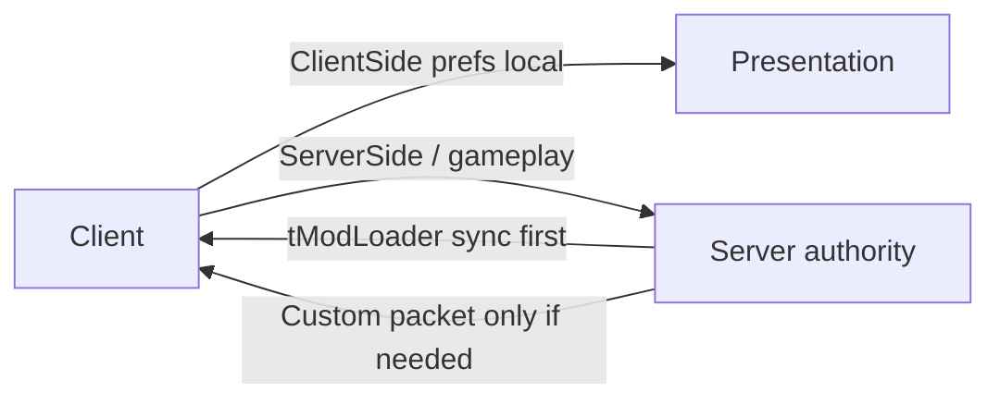

BestMultiplayer is named for multiplayer-safe design. The README states the policy; no configs or packets are implemented yet.[^1]

| Concern | Rule |
|---|---|
| Client presentation prefs | `ConfigScope.ClientSide` |
| Shared gameplay / server policy | `ConfigScope.ServerSide` |
| Custom network packets | Only for runtime state tModLoader does not already sync |
| Load side | `side = Both` in `build.txt`[^2] |

## Why it matters

Splitting scopes early avoids desync and “host-only feels different” bugs. Prefer built-in tModLoader synchronization before inventing packet types.[^1]

## Related

- [Scaffold conventions](scaffold-conventions.md)
- [BestMultiplayer mod](../entities/best-multiplayer-mod.md)

[^1]: README.md
[^2]: build.txt
