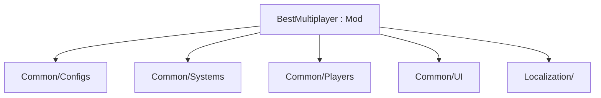

New work goes into typed folders under `Common/` (and later `Content/` if needed). The root `Mod` class stays limited to lifecycle or networking.[^1][^2]

## Folders

| Path | Responsibility |
|---|---|
| `Common/Configs/` | `ServerConfig`, `ClientConfig`, custom config elements |
| `Common/Systems/` | Boss lives, death UI host, wormhole hooks |
| `Common/Players/` | Team join, lives lock, spectate, boss-death respawn |
| `Common/UI/` | Spectate head grid state |
| `Common/Packets.cs` | Custom packet ids |
| `Localization/` | `.hjson` labels and tooltips |
| `Content/` | Items/NPCs/tiles — only when needed |

## Naming lockstep

On rename, keep aligned: mod folder, `build.txt`, main `.cs` type/namespace, `.csproj` `AssemblyName` / `RootNamespace`.[^1][^3]

## Related

- [Mod anatomy](mod-anatomy.md)
- [Multiplayer config rules](multiplayer-config-rules.md)
- [BestMultiplayer mod](../entities/best-multiplayer-mod.md)

[^1]: README.md
[^2]: BestMultiplayer.cs
[^3]: BestMultiplayer.csproj
