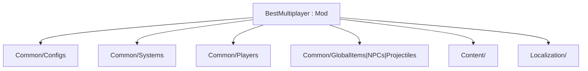

The scaffold is intentionally feature-neutral. New work goes into typed folders; the root `Mod` class stays limited to mod-wide lifecycle or networking.[^1][^2]

## Suggested folders

| Path | Responsibility |
|---|---|
| `Common/Configs/` | `ModConfig` classes |
| `Common/Systems/` | World or lifecycle systems |
| `Common/Players/` | `ModPlayer` state and sync |
| `Common/GlobalItems/` | Cross-cutting item behavior |
| `Common/GlobalNPCs/` | Cross-cutting NPC behavior |
| `Common/GlobalProjectiles/` | Cross-cutting projectile behavior |
| `Content/` | Items, projectiles, NPCs, tiles, buffs |
| `Localization/` | `.hjson` labels and tooltips[^1] |

None of these folders exist yet — they are the planned shape only.[^1]

## Naming lockstep

On rename, keep aligned: mod folder, `build.txt`, main `.cs` type/namespace, `.csproj` `AssemblyName` / `RootNamespace`.[^1][^3]

## Related

- [Multiplayer config rules](multiplayer-config-rules.md)
- [BestMultiplayer mod](../entities/best-multiplayer-mod.md)

[^1]: README.md
[^2]: BestMultiplayer.cs
[^3]: BestMultiplayer.csproj
