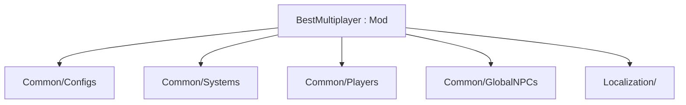

New work goes into typed folders under `Common/` (and later `Content/`). The root `Mod` class stays limited to lifecycle or networking.[^1][^2]

## Folders

| Path | Responsibility | Present? |
|---|---|---|
| `Common/Configs/` | `ServerConfig`, `ClientConfig` | Yes |
| `Common/Systems/` | World/session systems (`BossFightSystem`) | Stub |
| `Common/Players/` | `ModPlayer` state (`BestMultiplayerPlayer`) | Stub |
| `Common/GlobalNPCs/` | Shop / NPC hooks (`ShopGlobalNPC`) | Stub |
| `Common/UI/` | Client UI | Later |
| `Content/` | Items, projectiles, NPCs, tiles, buffs | Later |
| `Localization/` | `.hjson` labels and tooltips | Yes |

## Naming lockstep

On rename, keep aligned: mod folder, `build.txt`, main `.cs` type/namespace, `.csproj` `AssemblyName` / `RootNamespace`.[^1][^3]

## Related

- [Mod anatomy](mod-anatomy.md)
- [Multiplayer config rules](multiplayer-config-rules.md)
- [BestMultiplayer mod](../entities/best-multiplayer-mod.md)

[^1]: README.md
[^2]: BestMultiplayer.cs
[^3]: BestMultiplayer.csproj
