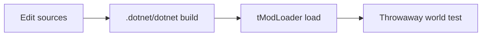

Two build surfaces share the same project file: VS Code task and in-game Build + Reload.[^1]

## First-use path

1. Launch tModLoader; Create Mod once to init `ModSources`.
2. Open Sources; copy scaffold in or merge into generated project.
3. Open **`BestMultiplayer.csproj`** in VS Code (not a lone `.cs` file).[^1]

## VS Code

| Setting | Value |
|---|---|
| Default task | `tModLoader: build mod` |
| Command | `${workspaceFolder}/.dotnet/dotnet build BestMultiplayer.csproj` |
| PATH | Prefixed with workspace `.dotnet` |
| defaultSolution | `BestMultiplayer.csproj` |
| Hidden | `bin/`, `obj/` |

## Machine-local pieces

- `.dotnet/` — vendored SDK (gitignored); required by the VS Code task on this machine.
- `tMLMod.targets` path in `.csproj` points at this machine’s Steam tModLoader install — regenerate via Create Mod when moving hosts.[^1][^2]
- `bin/` / `obj/` — build outputs, gitignored.

## Related

- [BestMultiplayer mod](best-multiplayer-mod.md)

[^1]: README.md
[^2]: BestMultiplayer.csproj
